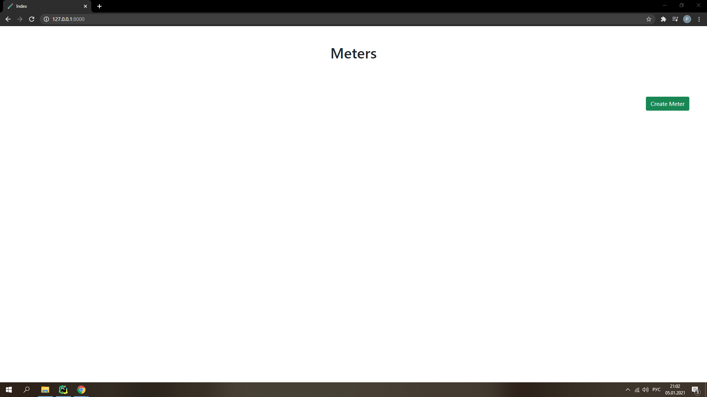
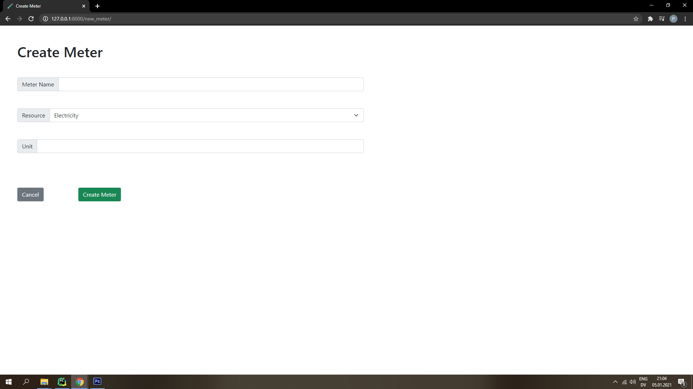
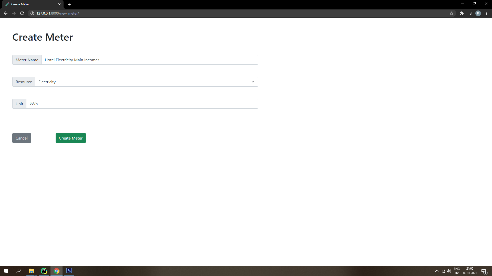
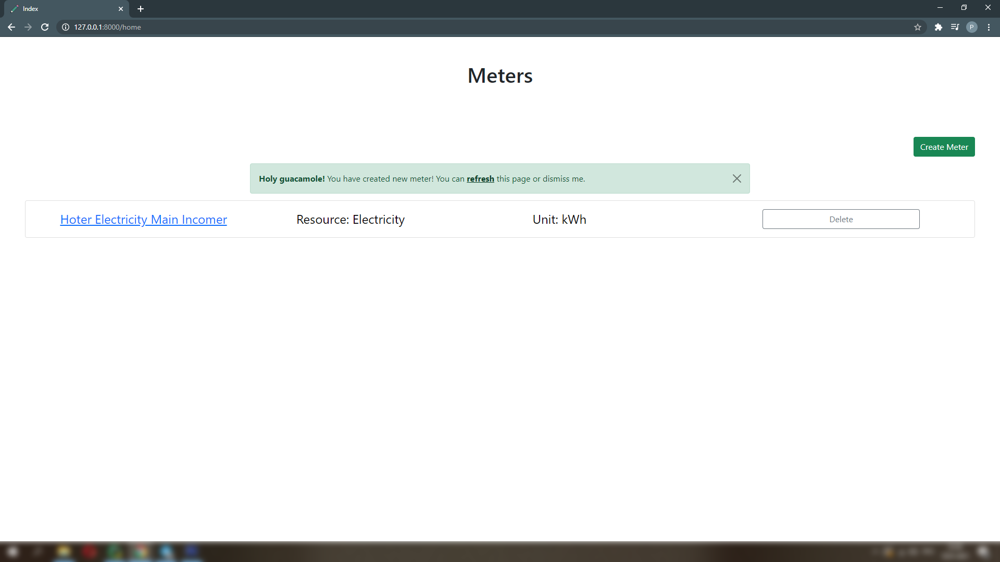
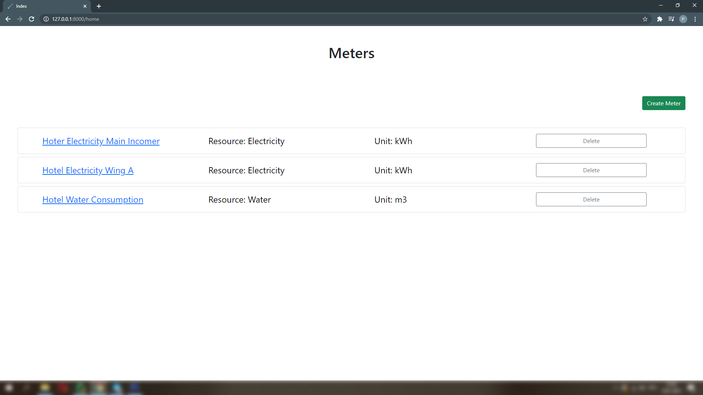
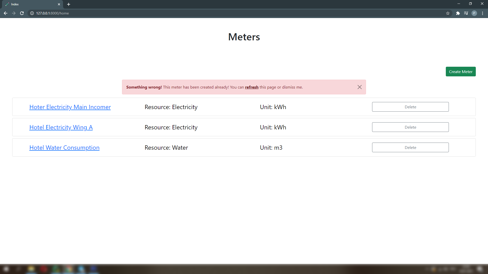
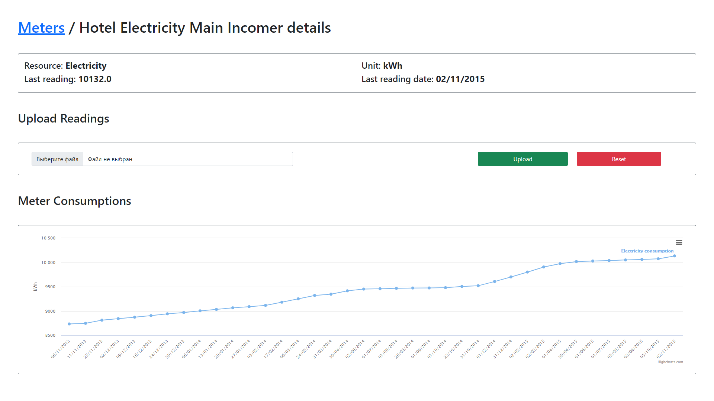
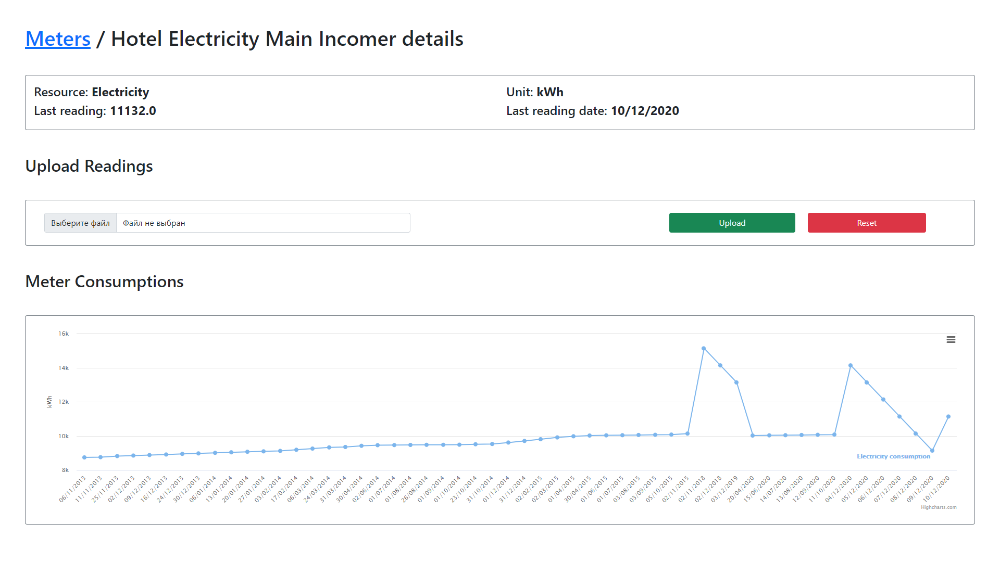
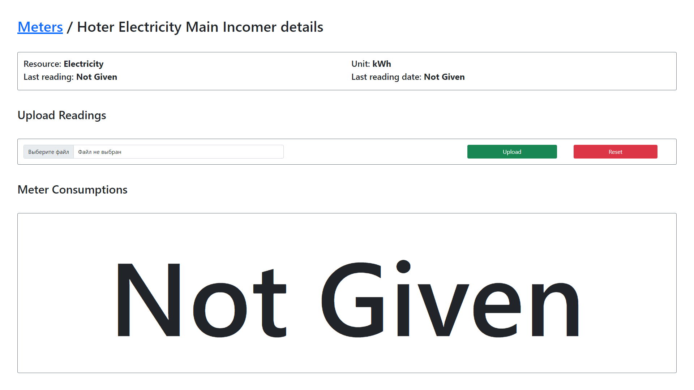
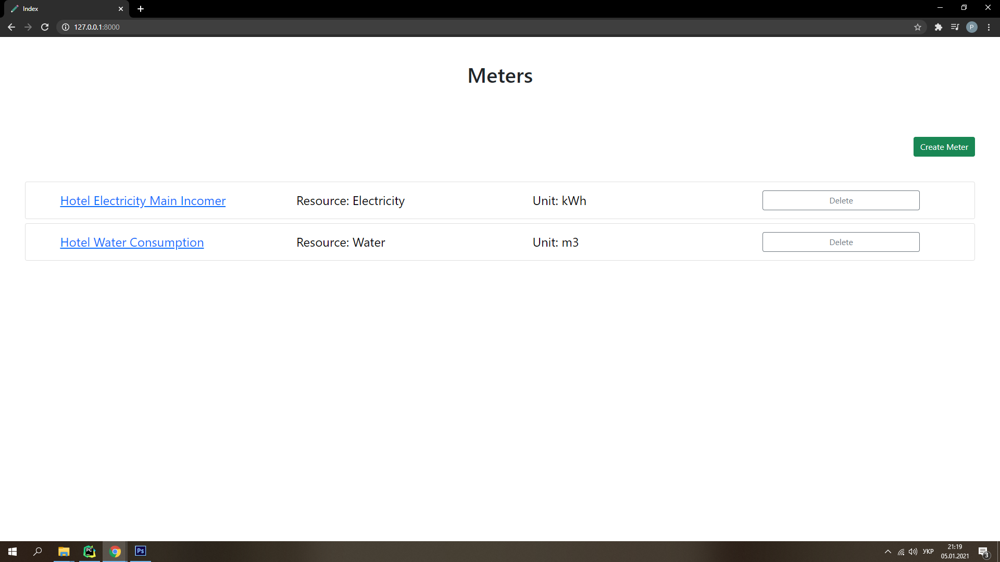

# Meters Monitoring

(Python, Django)

## Review

1. Main page without meters:
   

2. Create meter page:
   

3. Completed form on create meter page:
   

4. Just created new meter:
   

5. Created 3 meters for example:
   

6. Model Meter has a constraint unique, so if you will try to create a meter with the same name, you will get error
   message:
   

7. Meter details page without statistic data:
   

8. Meter details after uploading data in `.csv` file:
   

9. Also, you can add new data or update previous by loading `*.csv` files with data:
   

10. If your file contain some unsuitable data that should not be added in the meter, you will see an alert with error explanation. Errors divided on one-line error and errors with additional details:

11. If you need to remove all meter data, you should press `Reset` button:
    

12. You can delete a meter on using `Delete` button that located aside:
    
    
    
    
13. The project has customized error pages, for example 404 error page:

## Launching

1. Clone this repository.
2. Install requirements: [`requirements.txt`][requirements-location]. You can use pip `pip install -r requirements.txt`.
3. Create database schema `create database meter_project;`.
4. Manage settings in [`settings.py`][settings-location]:
   `DATABASES = {
   'default': {
   'ENGINE': 'django.db.backends.mysql',
   'NAME': 'meter_project',
   'USER': 'root',
   'PASSWORD': '12345' } }`
   
5. Enjoy!

## Testing

To launch business logic test cases type `python manage.py test` in command line.

[requirements-location]: ./requirements.txt

[settings-location]: ./djangoTestProject/settings.py